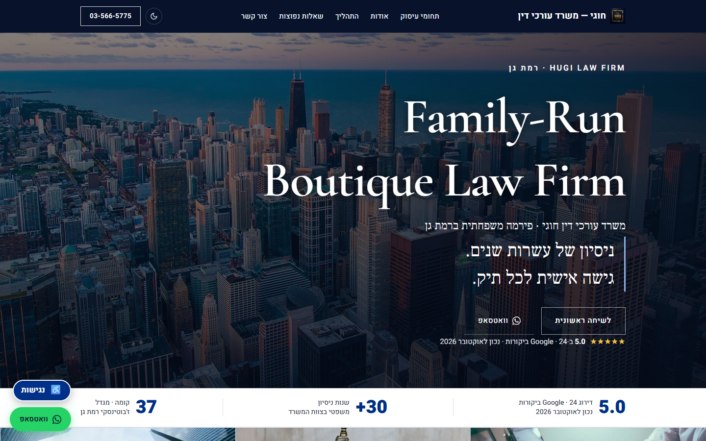

# Hugi Law Firm website

Official site of Hugi Law Office (משרד עורכי דין חוגי), a family-run firm in Ramat Gan.

**Live:** [hugilaw.co.il](https://hugilaw.co.il/)



Hebrew, right-to-left, one page. Fonts and images are self-hosted. The only request that leaves the site is the contact form, which posts to Web3Forms.

## Stack

- [Vite](https://vite.dev/) builds the static site. Pages live in `src/`, and hashed files land in `dist/assets/`.
- TypeScript, strict, for the page behavior. `src/scripts/main.ts` is the only place that wires features together.
- CSS split by component. `src/styles/main.css` only lists the import order.
- Vitest for the pure logic. Playwright and axe-core for the built site in Chrome, Firefox, WebKit, and mobile Safari.
- Cloudflare serves `dist/`. `wrangler.jsonc` points at that folder and serves the built 404 page for unknown paths. GitHub Actions only runs checks. Publishing is a local `npx wrangler deploy` after the build.

## Layout

```
src/
  index.html, 404.html
  styles/          base, layout, components, a11y preferences
  scripts/
    main.ts        composition root
    config/        phone, form endpoint, timeouts
    i18n/          Hebrew strings used by scripts
    core/          DOM lookup, storage, focus trap, Escape stack
    features/      theme, navigation, FAQ, modals, accessibility panel, contact form
  assets/          fonts and images (fingerprinted by the build)
public/            _headers, robots.txt, sitemap.xml, favicons, media/
tests/e2e/         Playwright
tests/unit/        Vitest
```

Features receive the elements, the storage, and the form submitter they need. Adding an accessibility option is a row in `src/scripts/features/a11y/a11y-options.ts`. Each open overlay registers its own Escape handler, so there is no central key-order chain.

## Scripts

Requires Node 22 or newer (`engines` and `.nvmrc`).

| Command               | What it does                                        |
| --------------------- | --------------------------------------------------- |
| `npm run dev`         | Local site with reload                              |
| `npm run check`       | Typecheck, lint, unit tests, and a production build |
| `npm run test:e2e`    | Builds, then runs Playwright against the preview    |
| `npm run test:chrome` | The same suite, Chrome only                         |
| `npm run build`       | Replaces `dist/`                                    |
| `npm run preview`     | Serves the built `dist/` at `http://127.0.0.1:4173` |

`npm run check` covers ESLint (strict TypeScript), Stylelint, html-validate, and Prettier.

## Update the live site

`dist/` is build output. `.gitignore` excludes it, so a Git push does not publish the site and hand-edits in `dist/` are discarded on the next build.

1. Edit `src/` or `public/`.
2. Rebuild. `npm run build` empties `dist/` and writes a new copy. Vite fingerprints files under `dist/assets/`. Files in `public/` (`_headers`, `robots.txt`, `sitemap.xml`, favicons, `media/`) are copied through unchanged.
3. Look at the result with `npm run preview`.
4. From the repo root, publish that `dist/`:

```
npx wrangler deploy
```

`wrangler.jsonc` is the Cloudflare config: the Worker name is `hugi-law-firm-website`, and unknown paths use the built 404 page. Deploy only after a fresh build, so Cloudflare is not serving a stale `dist/`.

Commit the source change. Tag the commit that was deployed, for example `prod-2026-10-06`. The tag is the record of what was published, because `dist/` itself is not in Git.

## Keep these in step

**Public domain.** If `hugilaw.co.il` changes, update the same origin in all of these:

- `src/index.html` — canonical, Open Graph, and the LegalService JSON-LD. A comment in `<head>` marks the spot.
- `public/robots.txt`
- `public/sitemap.xml`, including `lastmod`

`public/_headers` already sends `X-Robots-Tag: noindex` for `workers.dev` and `pages.dev` hostnames.

**Contact form.** The form posts to `https://api.web3forms.com/submit`. The hidden `access_key` in `src/index.html` chooses which Web3Forms form receives it. The key is public by design. Replacing it means creating the form in that Web3Forms account and pasting the new key. The fields the page sends are `name`, `phone`, and `message`.

How long Web3Forms keeps a submission is set in the dashboard, not in the repo: Form Settings → Advanced Options. It is currently 7 days, and the privacy policy says so. Change the policy in the same edit if that setting changes.

`public/_headers` allows the browser to call only `https://api.web3forms.com`. A different form host needs a CSP change and a privacy-policy change.

**Facts on the page.** Update every copy together:

- The office is floor 37, מגדל משה אביב (שער העיר), ז'בוטינסקי 7, רמת גן. Jabotinsky is the street. The tower name is Moshe Aviv (Shaar HaIr). The same address appears in the contact block, the privacy policy, the accessibility statement, and the JSON-LD.
- The Google rating line includes the month it was checked. Change the score and the date together.

## Quality bar

- Content Security Policy is enforced from `public/_headers`. Styles and scripts are same-origin only. There is no `unsafe-inline`.
- axe-core runs in the light theme, the dark theme, and each accessibility preset, including the open panel, dialogs, form errors, and the mobile menu.
- The browser tests fail if the page sets a cookie, logs a console error, or requests any host other than itself and `api.web3forms.com`.
- Built files under `/assets/` are cached for a year. Their names change when the content changes. `public/media/` stays at fixed URLs because Open Graph and the structured data point at them.
